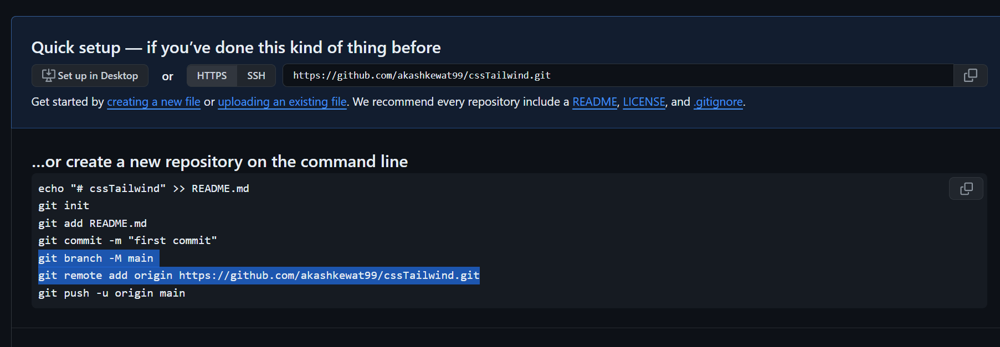

create repo on git without readme

> on vsCode

git init

git add .

git commit -m "added"

git branch -M main

git remote add origin https://github.com/akashkewat99/cssTailwind.git

follow using above snap

